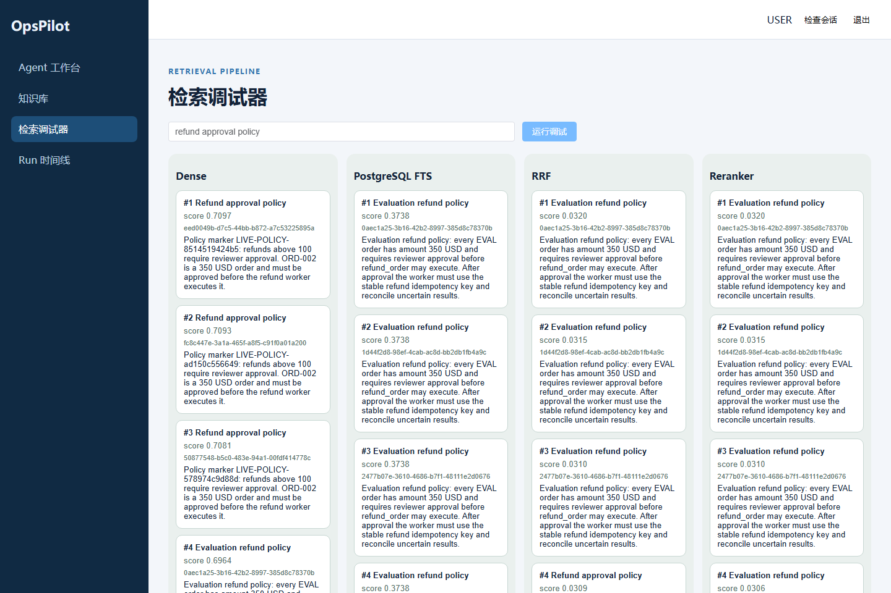
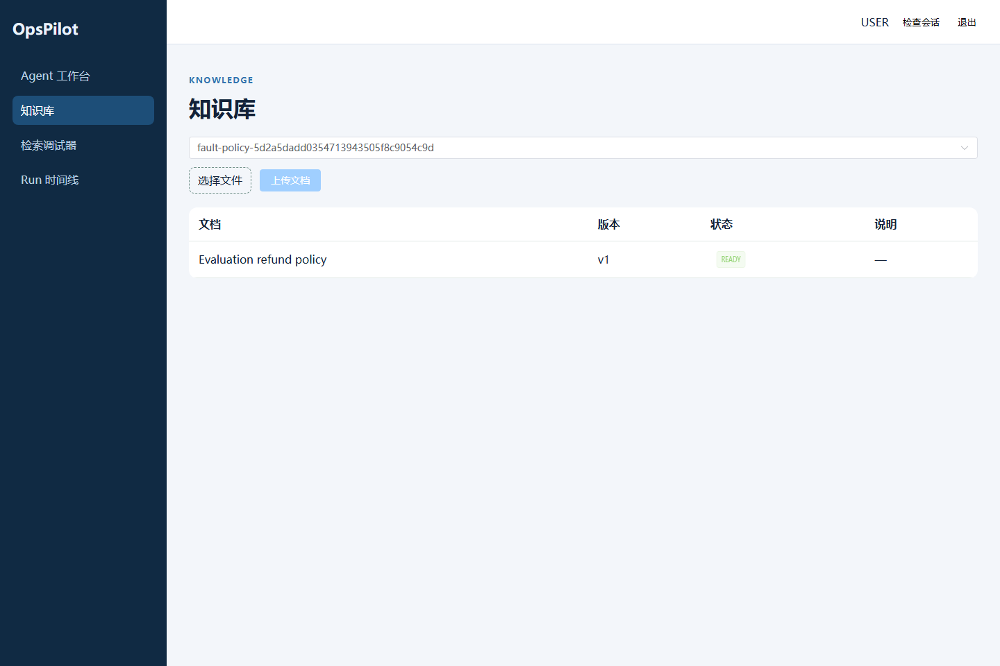

# OpsPilot

### 在权限、审批和审计约束下完成运营任务的 AI Agent

从知识库检索政策、给出精确引用，到申请退款审批、可靠执行和核对未知结果，整条链路可追踪。

**Vue 3 / TypeScript · FastAPI / Python · PostgreSQL / pgvector · Redis / ARQ · DeepSeek · BGE**

[启动指南](docs/getting-started.md) · [界面演示](docs/demo.md) · [架构](docs/architecture.md) · [可靠执行](docs/reliable-execution.md) · [评测](docs/evaluation.md)

> 当前为可本地运行的工程展示版本，不是已通过最终评测的 v1.0。Order / Payment / Email 是仓库内演示服务，不连接真实支付账户。

## 一条任务如何完成？

1. 上传政策文档，后台解析、分块和索引，页面展示入库状态。
2. Agent 在用户可见范围内检索，回答携带精确文档版本与 Chunk 引用。
3. 退款由确定性 Policy 判断，需要审批时创建持久化 Operation。
4. Reviewer 批准后 Worker 执行；请求已发出但结果超时时先核对，不盲目重试。
5. Run 时间线记录状态和恢复过程，刷新、断线后从 PostgreSQL 补拉事实。

## 真实界面

截图来自本机实际运行服务与演示政策数据，不是设计稿。详情见[演示导览](docs/demo.md)。

### 四阶段检索调试

比较 Dense、PostgreSQL FTS、RRF、Reranker 的排序和分数，点击卡片查看精确版本原文。



### 知识库与文档状态

上传、版本与 READY / FAILED 状态统一展示；列表由后端权限范围过滤。



## 工程重点

- **检索前授权**：KnowledgeScope 进入候选 SQL，而非事后 Python 过滤。
- **引用有依据**：通过 BuiltContext 身份校验；无证据或非法引用不伪造来源。
- **审批不可变**：绑定 `operation_id + arguments_hash + operation_version`。
- **副作用先核对**：`OUTCOME_UNKNOWN → RECONCILING`；演示 Payment 使用业务幂等键防重。
- **Worker 可恢复**：持久化消息、Outbox、Claim/Lease、Heartbeat 与 Fencing 限制旧 Worker 回写。
- **事件可补齐**：PostgreSQL 是事实源，Redis 仅传通知和任务身份；SSE 按序恢复。
- **评测可追溯**：版本化语料、配置哈希和执行收据，保留失败结果，不改写成成功。

## 系统分工

浏览器通过 FastAPI 登录、上传、发起 Run、审批和读取事件。API 将业务事实与 Outbox 写入 PostgreSQL；Publisher 向 Redis/ARQ 投递 ID；Worker 调用检索、生成和演示服务，再以受 Fencing 保护的事务写回。

PostgreSQL 保存文档、向量、业务状态、Journal、Attempt 和评测记录。Redis **不是**业务事实源。

OpsPilot 是一个面向企业运营场景的可审计 AI Agent 项目。它将权限感知 RAG、引用回答、工具审批、可靠副作用执行、事件日志和可复现实验整合在一个模块化单体中。

## 当前状态（2026-09-10）

- M1（任务 1–4）已完成并通过复审。
- M2 / 任务 5（权限感知 Hybrid Retrieval）、任务 6（Reranker、上下文预算与引用回答）与任务 7（Run Journal 与 Transactional Outbox）已通过督导复审。
- M3 / 任务 8（Tool Registry、受限 Agent Loop 与演示服务）已通过督导复审。
- 当前阶段：本机工程展示与部署；最终冻结评测尚未获通过。
- 当前分支：`plan/opspilot-core-mvp`。
- 任务1–17已通过督导复审；冻结评测已执行，旧收据与 320 行结果保留，不重写历史评分。
- 最近修复的隔离门禁：589 passed / 4 skipped；前端 19 单元测试 / 8 浏览器回归，类型检查、构建、Ruff、Mypy 通过。这些不是模型准确率，也不代表所有浏览器测试都使用真实 Provider。
- 真实 BGE + DeepSeek + 公开 Run/message 精确引用诊断通过；评测环境缺少对应版本来源知识，详见[根因与修复](docs/task18-root-cause-20260909.md)。
- 最新开发状态见[开发进度](docs/development-progress.md)。

## 技术栈

- Backend：Python 3.12、FastAPI、SQLAlchemy 2、Alembic、ARQ。
- Data：PostgreSQL 16、pgvector、PostgreSQL FTS、Redis 7。
- Models：DeepSeek OpenAI-compatible Chat、BGE-M3 Embedding、BGE Reranker。
- Frontend：Vue 3、TypeScript、Vite、Element Plus。

## 本地启动

```bash
git clone https://github.com/Takezs/OpsPilot.git
cd OpsPilot
```

按[启动指南](docs/getting-started.md)配置私有环境、初始化数据库和账号，再启动完整拓扑。Web 默认 `http://127.0.0.1:8088`；API 文档 `http://127.0.0.1:8000/docs`。

需要可用 DeepSeek API 与已加载 BGE 模型的服务。没有公共账号或内置生产密码；首次身份/知识库初始化仍需维护者显式完成，不宣称零配置启动。已有本机环境见[本机包说明](deploy/local-package/LOCAL-README.md)。禁止提交 `.env` 或密钥。

## 代码导航与边界

- `backend/src/opspilot/`：Auth、Knowledge、Retrieval、Generation、Agent、Approvals、Execution、Runs、Evaluation。
- `frontend/src/`：工作台、知识库、检索调试、引用抽屉、审批与时间线。
- `demo-services/`：订单、支付、邮件演示服务。
- `evaluation/`：版本化生成器和评测产物；冻结 test 不是普通演示入口。
- `deploy/`：Dockerfile、Compose 覆盖与本机打包脚本。

演示 Payment 使用内存记录；BGE 重启后需确认模型重新加载；前端仍有非阻塞 bundle size 提示。公网部署还需独立完成 TLS、密钥管理、备份和运维配置。

## 开发文档

- [开发进度](docs/development-progress.md)
- [Agent 交接说明](docs/agent-handoff.md)
- [继续开发提示词](docs/prompts/continue-development.md)
- [架构设计规格](docs/superpowers/specs/2026-08-19-opspilot-core-mvp-design.md)
- [完整实现计划](docs/superpowers/plans/2026-08-19-opspilot-v1-implementation.md)
- [架构](docs/architecture.md)
- [检索与引用](docs/retrieval.md)
- [可靠执行](docs/reliable-execution.md)
- [评测](docs/evaluation.md)
- [面试证据](docs/interview-guide.md)

参与开发前必须阅读根目录的 [AGENTS.md](AGENTS.md)。
